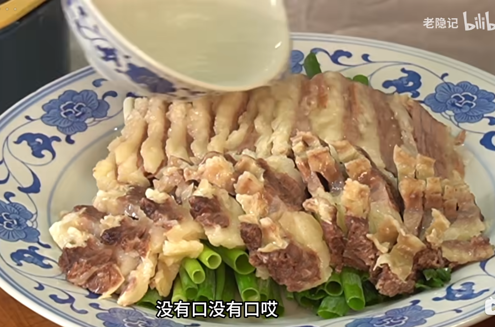

- 清蒸牛肉 #食谱
	- 原料：牛肋条、小葱、
	- 牛肋条泡水3h去血水
	  logseq.order-list-type:: number
	- 冷水下锅，+大块葱姜、花雕酒、胡椒粒（胡椒粉直接散了，所以用粒）去腥，煮40min（五成熟即可）
	  logseq.order-list-type:: number
		- 泡血水就是为了，焯水这步少出血沫，让原汤更好喝
		  logseq.order-list-type:: number
	- 捞出改刀：切片
	  logseq.order-list-type:: number
	- 底上垫小葱，将牛肉放置其上，原汤加盐，浇淋在牛肉上
	  logseq.order-list-type:: number
		- 
		  logseq.order-list-type:: number
	- 蒸20min即可
	  logseq.order-list-type:: number
	-
	-
	- logseq.order-list-type:: number