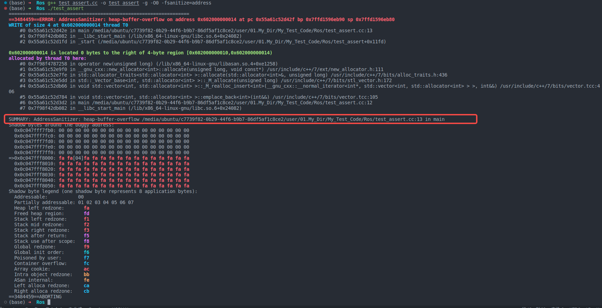
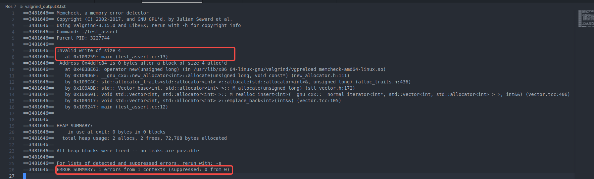

- 每次崩溃在不同位置问题分析： #Learn #Work #CPP #CPP/cmake #core_dump
	- 最近遇到了很多core dump问题，且栈帧被破坏，每次core dump的位置都不一样。
	- 请教了德据：
		- 基于一个可跑的版本，依次添加新代码，然后跑，从而定位是添加了那一句代码导致的崩溃。
		  logseq.order-list-type:: number
		- 我在不可跑的代码上，逐一注释新代码，从而测试出了添加第九根车道线时会崩溃。
	- 但是为什么超过8根就会崩溃呢？
		- 我又将所有新代码回退掉，在不同的位置手动添加一根，发现：只要是在我们自己的库内添加就会导致崩溃，在平台添加都没有问题，那么为什么呢？
	- 由于栈帧信息一直被破坏，因此怀疑栈溢出，且板子栈只有8M大小，遂尝试检验在添加第九根车道线前后是否有栈溢出发生。
		- 询问了gpt，可以添加如下cmake语句：
			- ```cmake
			  set(CMAKE_CXX_FLAGS "${CMAKE_CXX_FLAGS} -fstack-protector")
			  ```
		- 当发生栈溢出的时候会报错提示。
		- 加上了，但是没有生效，也就是说没有栈溢出问题产生。
	- 但是在debug版本时意外发现一个assert触发了。（+assert真的很重要了...）
		- 遍历了一个大数组初始化一个小数组，导致小数组内存越界发生异常。
		  background-color:: red
		- 这个问题我之前就发现了，但是一直没什么事儿，就没管他。而且之前走读代码的时候另一个位置也有这种访问越界的情况，当时是运行了很久，但是没啥事儿，修复后没怎么重视过，没想到影响会这么大。
	- 什么是内存越界？内存越界其实就是内存踩踏。
		- 内存泄漏：程序中存在垃圾（未释放的一片无法访问的内存空间），这种线程称为内存泄漏。
		- 内存溢出：内存一直泄漏，导致最后没有内存分配了，就会导致内存溢出。
		- 内存踩踏：访问了不该访问的地址。
		- 野指针：未初始化的指针或指向未知区域的指针。
	- 为什么会出现内存踩踏？
		- 在C/C++中，指针的访问可以使用加号运算符做位置的偏移，从而访问元素。这带来了极高的灵活性，但是同时也引来了一系列的内存问题，因为很多操作在做偏移时并不会做越界检查。如vector的中括号访问等。
	- 有什么办法去检测这种内存踩踏吗？
		- 测试代码：
			- ```cpp
			  #include <algorithm>
			  #include <array>
			  #include <fstream>
			  #include <iostream>
			  #include <iterator>
			  #include <string>
			  #include <vector>
			  using namespace std;
			  
			  int main() {
			    vector<int> vec;
			    vec.emplace_back(1);
			    vec[1] = 10;
			  }
			  ```
		- g++内置工具
		  logseq.order-list-type:: number
			- 使用   `-fsanitize=address`   选项
			  logseq.order-list-type:: number
				- AddressSanitizer (ASan) 是一个快速的内存错误检测工具，集成在 GCC 和 Clang 编译器中。它可以检测数组访问越界、使用未初始化的内存等问题。
				- 
				- 指出了具体越界位置
			- 使用   `-fsanitize=undefined`   选项
			  logseq.order-list-type:: number
				- UndefinedBehaviorSanitizer (UBSan) 是一个用于检测未定义行为的工具，集成在 GCC 和 Clang 编译器中。它可以检测未定义行为。
				- 如：
					- ```cpp
					  #include <iostream>
					  #include <climits>
					  
					  int main() {
					      int a = INT_MAX;
					      int b = a + 1;  // 有符号整数溢出
					      std::cout << b << std::endl;
					      return 0;
					  }
					  
					  (base) ➜  Ros g++ test_assert.cc -o test_assert -g -O0 -fsanitize=undefined
					  (base) ➜  Ros ./test_assert                                                
					  test_assert.cc:6:9: runtime error: signed integer overflow: 2147483647 + 1 cannot be represented in type 'int'
					  -2147483648
					  ```
					-
		- 使用[[valgrind]]内存检测工具
		  logseq.order-list-type:: number
			- 可以得到详细的错误位置以及原因
			- 
		- ==对数组的访问警觉一些，德据就非常警觉，学习==
		  logseq.order-list-type:: number
			- 如：用一个数组的索引，同时循环遍历两个数组，即：用一个数组的索引去访问了另外的数组，导致越界！！！
			- 对于数组的中括号访问，需要警觉越界
			  background-color:: red