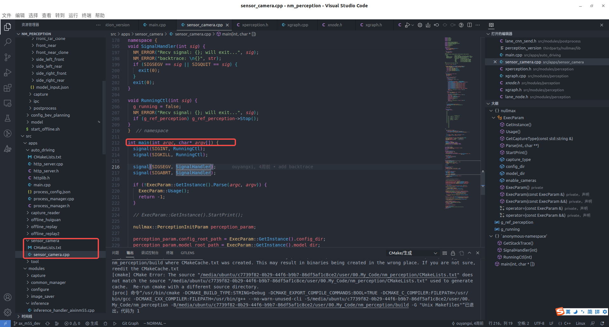

- nm_perception 感知进程入口函数 
-
- CPU绑核操作：将线程固定在一个核运行
	- ```cpp
	  void XNode::SetTargetCpu(const int cpu_id) {
	    if (cpu_id == CPU_ANY) return;
	    int num = sysconf(_SC_NPROCESSORS_ONLN); // 也可以使用get_nprocs()
	    MY_ASSERT((cpu_id >= 0) and (cpu_id < num), "cpu id invalid");
	    cpu_set_t cpuset;
	    CPU_ZERO(&cpuset); // 这里调用__builtin_memset,类似memset将cpuset的内存区域设为'\0'
	    CPU_SET(cpu_id, &cpuset);// 和上面一样，调用__CPU_ZERO_S宏函数，设置cpuset的值
	    pthread_setaffinity_np(pthread_self(), sizeof(cpu_set_t), &cpuset);
	    // man sched_setaffinity
	  }
	  
	  bool XNode::Start(int core) {
	    std::thread thr([this, core]() {
	      SetTargetCpu(core);
	      pthread_setname_np(pthread_self(), name_.c_str());
	      OnStart();
	      while (not stop_.load()) {
	        Process();
	        if (name_ == OBS_NODE_NAME) {
	          StatisticFPS();
	        }
	        ++frame_id_;
	      }
	      OnStop();
	      NM_ERROR("F: {}, L: {}, name: {}", __FUNCTION__, __LINE__, name_);
	    });
	    thr_ = std::move(thr);
	    return true;
	  }
	  ```
	- `cpu_set_t`
		- ```cpp
		  /* Size definition for CPU sets.  */
		  #define __CPU_SETSIZE	1024
		  #define __NCPUBITS	(8 * sizeof (__cpu_mask))
		  
		  typedef struct
		  {
		    __cpu_mask __bits[__CPU_SETSIZE / __NCPUBITS];
		  } cpu_set_t;
		  __cpu_mask就是unsigned long int  8字节
		  所以cpu_set_t就是一个 unsigned long int的数组，大小为16
		  ```
	- `_SC_NPROCESSORS_ONLN`
		- enum类型，84
	- `sysconf`
		- https://www.cnblogs.com/Anker/p/3751369.html
		- ```cpp
		  NAME
		         sysconf - get configuration information at run time
		  SYNOPSIS
		         #include <unistd.h>
		         long sysconf(int name);
		  更详细的参数使用信息可以查看man page的description
		  ```
	- CPU_ZERO、CPU_SET 宏函数
		- ```cpp
		  # define CPU_ZERO(cpusetp)	 __CPU_ZERO_S (sizeof (cpu_set_t), cpusetp)
		  # define CPU_SET(cpu, cpusetp)	 __CPU_SET_S (cpu, sizeof (cpu_set_t), cpusetp)
		  
		  # define __CPU_ZERO_S(*setsize*, *cpusetp*) \
		  do __builtin_memset (cpusetp, '\0', setsize); while (0)
		  ```