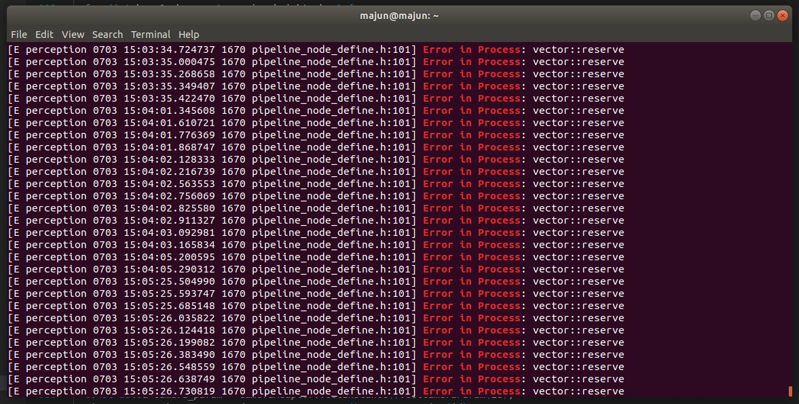

- 工作上： #日志
	- 评测的事情，可以继续跟进一下
	  logseq.order-list-type:: number
	- 周末有崩溃问题，蹦在L0信号函数那里，不知道怎么回事儿，可能需要看一下
	  logseq.order-list-type:: number
	- 这些都看完后，就继续看每日问题
	  logseq.order-list-type:: number
- 生活上： #日志
	- 今天大概7点下班吧，所以7点~11点有4h
	  logseq.order-list-type:: number
	- 1.5h STL
	  logseq.order-list-type:: number
	- 0.5h去完成代码
	  logseq.order-list-type:: number
	- 1h去看公司代码
	  logseq.order-list-type:: number
	- 1h去看B站、斗鱼、玩游戏吧。
	  logseq.order-list-type:: number
	- 11点睡觉
	  logseq.order-list-type:: number
-
- 最近reserve崩溃的问题，reserve崩溃会抛出`std::lengeh_error` #core_dump
	- 是由于停止线异常大，然后改变了车道线终点的值，导致车道线终点异常大，最后reserve的时候崩溃
	- nm_perception 平台上虽然这个崩溃发生了，但是有Log，并且貌似还能跑，我想看看是怎么实现的。
	- 用的 [[CPP/catch]]整个后处理，然后捕获到异常
	- ```cpp
	  try
	  {
	  	整个后处理
	  }
	  catch(..)
	  {
	  	log( error )
	  }
	  ```
		- 
- 车道线如果崩溃了怎么办？ #core_dump
	- 询问测试人员具体场景，在什么场景崩溃的？
	  logseq.order-list-type:: number
		- 能否用测试数据复现？
		  logseq.order-list-type:: number
	- 是否有core dump信息，辅助定位具体代码位置。
	  logseq.order-list-type:: number
	- 排查 [[core_dump]]内记录的崩溃原因
	  logseq.order-list-type:: number
	- 是否有log，log是否是异步的？
	  logseq.order-list-type:: number
	-