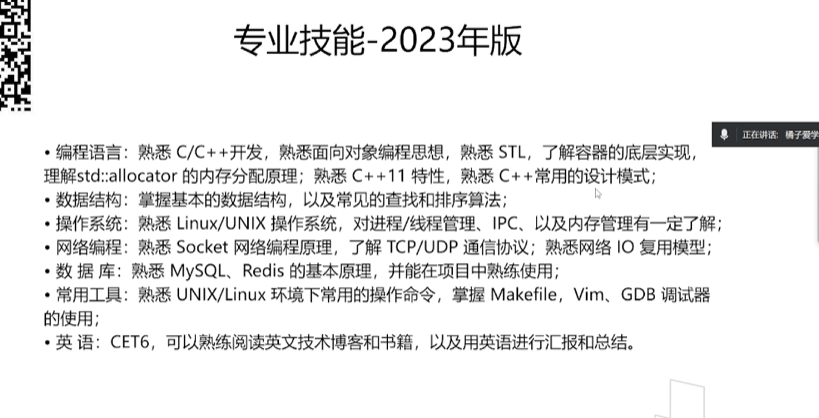
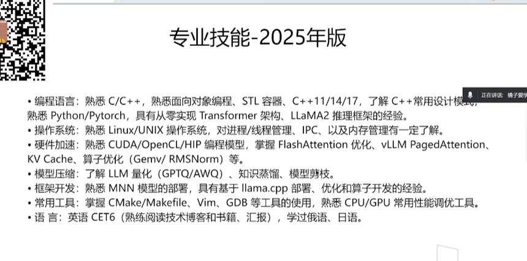
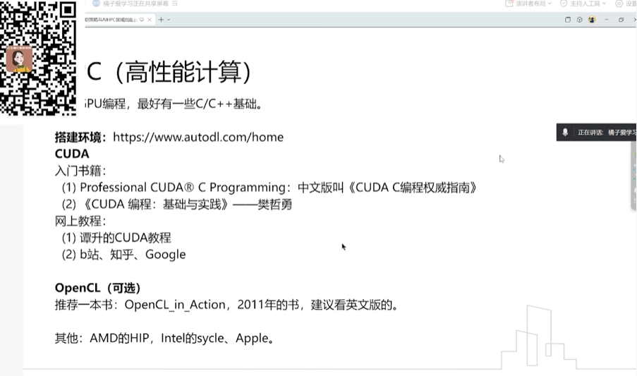
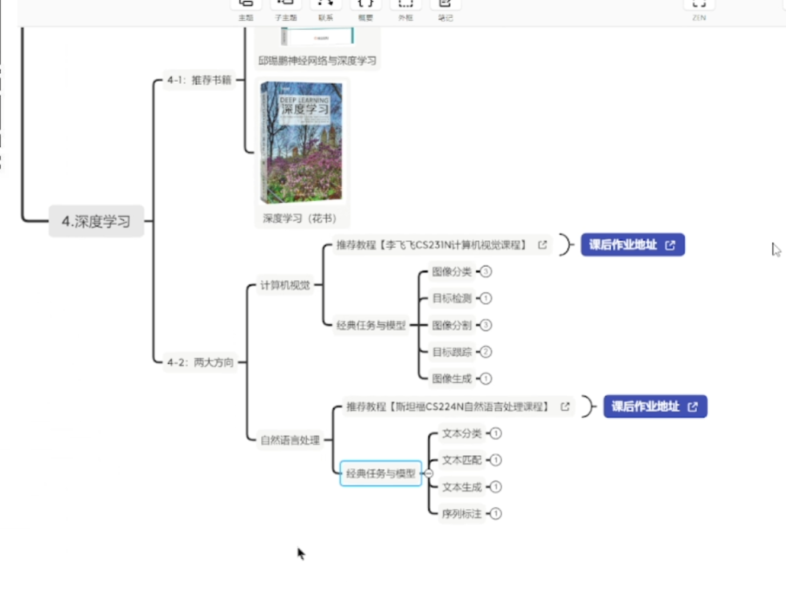

# AI、HPC领域分享 #Learn #Work
	- 他的第一份工作：面试官：有C++基础，AI可以后来慢慢学习
	- ## 求职策略
		- 面了20天，每天3~5场
		- 23年
			- 
			- 针对想去的行业，进行调整，表明自己会那些技术
		- 25年
			- 
		- 简历里面以最近的几份工作、且与想面的方向有关的工作经历为主，其他都一笔带过就可以了
	- ## AI、HPC指南（他是如何学习的）
		- AI
			- 学习路径
				- 早期找了个人2K带（没用）
				- 报线下班（1.7W），没太大用
					- 多个监督和答疑的作用
			- 网络视频和教程
				- B站（入门深度学习）
				- 黑马的课程
					- python
					- 机器学习（了解一些工作相关的算法就行了）
					- pytorch
					- 深度学习基础
						- NLP
						- CV
				- 李宏毅的课
					- 看了些感兴趣的章节
				- google的博客
			- 工作
				- 就是AI和HPC，所以也是边做边学
		- 高性能计算
			- GPU编程，最好有C/C++基础
			- 
			- 
- ==目前工作的目标：提升技能+积累好的项目经验== #Learn
	- 什么是好的技能？
		- 招聘网站jd上反复出现的
	- 什么是好的项目？
		- 招聘网站上反复出现的