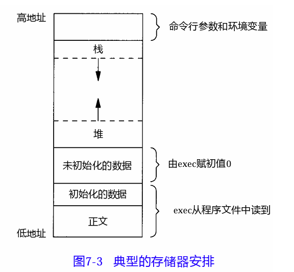

- C程序的存储空间布局（逻辑布局） #C #进程/进程环境
	-  #exec
	- 正文段（==代码段==）。这是由CPU执行的机器指令部分。存放可执行程序的机器指令。只读、共享。
		- 正文段是可共享的，所以即使是经常执行的程序(如文本编辑程序、C编译程序、shell等)在存储器中也只需有一个副本。
		- 正文段常常是只读的，以防止程序由于意外事故而修改其自身的指令。
	- 初始化数据段。通常将此段称为==数据段==，已初始化的全局变量和静态变量。
		- 例如， C程序中任何函数之外的说明：
		- ```cpp
		  int maxcount = 90;
		  ```
		- 使此变量以初值存放在初始化数据段中。
	- 非初始化数据段。通常将此段称为==bss段==，存放未初始化的全局变量和静态变量，默认值是0。这一名称来源于早期汇编程序的一个操作符， 意思是“block started by symbol（由符号开始的块）”，在程序开始执行之前，内核将此段初始化为0。
		- 函数外的说明：
		- ```c
		  long sum[1000] ;
		  ```
		- 使此变量存放在非初始化数据段中。
	- ==栈==。地址自上向下减少。存放函数局部变量、函数栈帧，先进后出的结构。 #栈 #栈帧
		- 自动变量以及每次函数调用时所需保存的信息都存放在此段中。每次函数调用时， 其返回地址、以及调用者的环境信息（例如某些机器寄存器）都存放在栈中。然后，新被调用的函数在栈上为其自动和临时变量分配存储空间。通过以这种方式使用栈， C函数可以递归调用，递归函数每次调用自身时，就用一个新的栈帧，因此一次函数调用实例中的变量集不会影响另一次函数调用实例中的变量。
	- ==堆==。地址自下而上增加。存放动态分配的内存，包括`new`、`malloc`出来的内存。先进先出的机构。 #堆 #new #malloc
	- ==只有正文段和数据段存放在磁盘程序文件中==。bss段由于需要内核提前将其置为0，因此存放在内存中。
	- > a.out中还有若干其他类型的段，如包含符号表的段、包含调试信息的段以及包含动态共享库链接表的段等。这些部分并不装载到进程执行的程序映像中。
	- 使用`size`命令可以报告正文段、数据段和bss段的长度（以字节为单位）。 #size
		- ```bash
		  size - list section sizes and total size of binary files
		  dec:十进制数，为text、data、bss段总和。
		  hex为16进制
		  
		  (base) ubuntu@VM-16-2-ubuntu:~/My_Code/zhihu$ size test
		     text    data     bss     dec     hex filename
		     1751     608       8    2367     93f test
		  ```
-
-
-
-