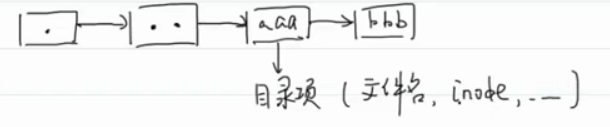

- 目录的原理 #Linux/目录 #Linux/文件系统 #Linux/文件系统/目录操作
  card-last-score:: 3
  card-repeats:: 1
  card-next-schedule:: 2022-07-13T01:09:20.092Z
  card-last-interval:: 4
  card-ease-factor:: 2.36
  card-last-reviewed:: 2022-07-09T01:09:20.094Z
  id:: 65ab631e-69ad-455f-8a49-3c08f2adbd2d
	- 目录的本质：文件，这个文件里面的内容是一些目录项（文件名称，inode）
		- 
	- **如果想在目录中添加或删除文件，一定要获取这个目录的写权限**
	- 更多原理可以了解操作系统。如：考研咸鱼的操作系统讲解就很好，操作系统导论等。
	-
-