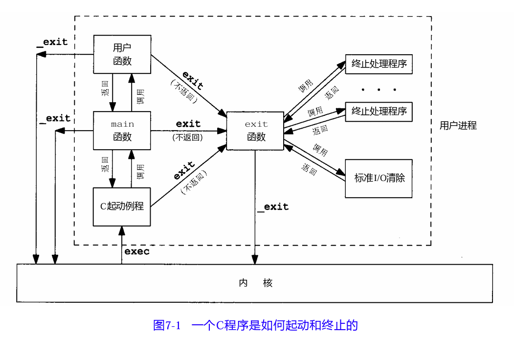

- 函数 `atexit` #atexit #exit #main #进程/进程环境
	- ```cpp
	  #include <stdlib.h>
	  int atexit(void (*func)(void));
	  成功返回0，失败返回-1
	  atexit就像形成一个栈，exit调用函数的顺序与登记时候相反
	  ```
	- 按照ISO C规定，一个进程可以登记多至32个函数(具体最大支持的数目可以用`sysconf`函数查看)，这些函数将由`exit`自动调用。这些函数称为`终止处理程序(exit handler)`，可以调用`atexit`函数登记这些函数。如果程序调用`exec`函数族中的任一函数，则会清楚所有已登记的`终止处理程序`。 #sysconf
	- 一个C函数是如何启动的，以及如何终止的各种方式： #C #exec
		- 
			- 内核使程序执行的唯一方法是调用一个exec函数。进程资源终止的唯一方法是显式或隐式地（通过调用`exit`）调用`_exit`或`_Exit`，进程也可以非自愿的由一个信号终止。 #exec
	- 示例：
		- ```cpp
		  #include <stdlib.h>
		  #include <iostream>
		  using std::cout;
		  using std::endl;
		  
		  static void my_exit1()
		  {
		      cout << "first exit handler!" << endl;
		  }
		  
		  static void my_exit2()
		  {
		      cout << "second exit handler!" << endl;
		  }
		  
		  int main()
		  {
		      if (atexit(my_exit2) != 0) {
		          cout << "error, can't register my_exit2" << endl;
		      }
		      if (atexit(my_exit1) != 0) {
		          cout << "error, can't register my_exit1" << endl;
		      }
		      if (atexit(my_exit1) != 0) {
		          cout << "error, can't register my_exit1" << endl;
		      }
		      cout << "main is done" << endl;
		      return 0;
		  }
		  
		  
		  (base) ubuntu@VM-16-2-ubuntu:~/My_Code/zhihu$ ./test 
		  main is done
		  first exit handler!
		  first exit handler!
		  second exit handler!
		  ```
		- ==注意：上面没有显式调用exit==
-