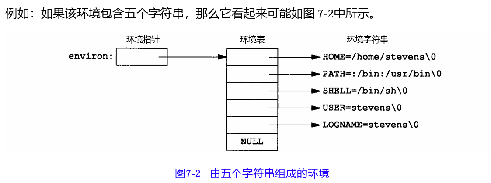

- 环境表 #C #CPP  #environ #进程/进程环境
	- 每个程序都有一张环境表，与参数表一样，是一个字符指针数组，以NULL结尾，每个指针包含一个以NULL结尾的C字符串地址。全局变量`environ`则包含了该指针数组的地址。 #static #environ
	- ```cpp
	  extern char **environ;
	  ```
	- 
		- 按照惯例，环境由 `name = value` 这样的字符串组成。通常用`getenv`和`putenv`函数来存取特定的环境变量，而不是用`environ`变量。但是，如果要查看整个环境，则必须使用`environ`指针。
	-
-