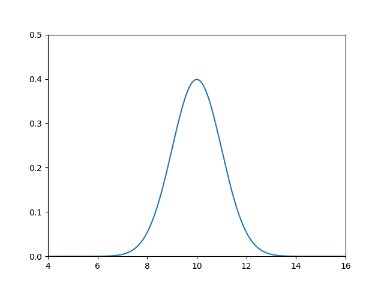
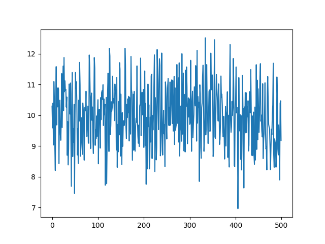
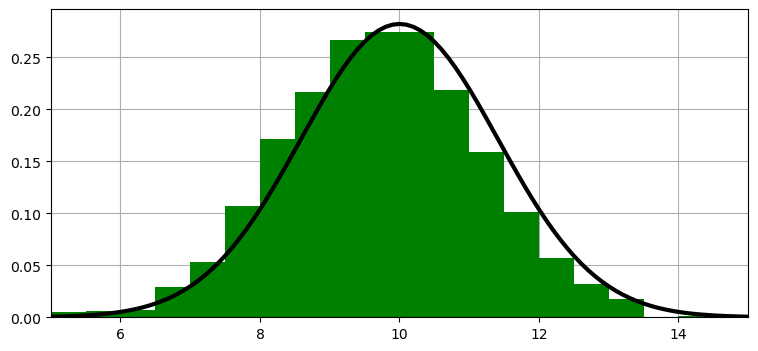
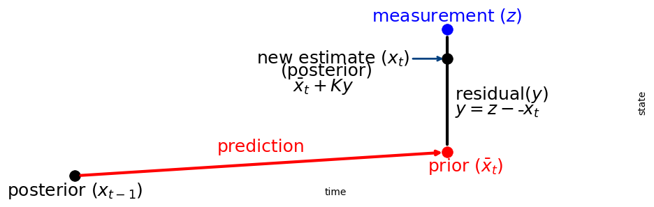

- > Where do the names `z`, `P`, `Q`, and `R` come from? You will see them used in the rest of this book. In the literature $R$ is nearly universally used for the measurement noise, $Q$ for the process noise and $P$ for the variance of the state. Using $z$ for the measurement is common, albeit not universal. Almost every book and paper you read will use these variable names. Get used to them.
- `z`, `P`, `Q`, and `R`分别代表什么意思？
	- > 这几个值都只是看着吓人，学术文章中的垃圾命名。其实都是很容易理解的东西
	- $R$是测量值的噪声(方差)。
	- $Q$是过程噪声，
	- $P$是状态方差，
	- $z$是测量值。
	- $K$是卡尔曼增益
		- 本质就是一个测量值和预测值之间的一个偏向的概率而已
			- ((6786923d-3f6c-44fd-b249-2a00f4906428))
- ## 一维卡尔曼滤波 #kalman
  collapsed:: true
	- 问题描述：
		- 一只狗在马拉松中移动。脖子上的项圈有一个传感器，传感器的值有误差，但是误差一般很小，如：狗移动了23m，传感器可能会给出22.9m或者23.1m，我们可以使用高斯对其建模。我们预测狗的移动，可能过了头，也可能没过头，也可以使用高斯来建模。
	- 我们可以用高斯来描述对狗的位置的置信度。初始我们相信狗在10m的位置，方差为1.
		- ```python
		  # 1. 假设狗的位置的信念符合正态分布
		  from scipy.stats import norm
		  import numpy as np
		  import matplotlib.pyplot as plt
		  
		  
		  gaussion = norm(10, 1)
		  xs = np.arange(4, 16, 0.05)
		  ys = [gaussion.pdf(x) for x in xs]
		  
		  plt.plot(xs, ys)
		  plt.xlim(4, 16)
		  plt.ylim(0, 0.5)
		  plt.show()
		  ```
		- 
		- 从图中可以看出我们对狗的位置并不确定，只能认为狗极有可能在10m的位置，但9~11m的任何位置都有可能。假设我们读取传感器500次，每次返回的值都在8~12之间，以10为中心，我们应该非常确信狗在10附近。
			- ```python
			  # 2. 假设读取传感器500次,所有数值都在10附近:
			  import numpy as np
			  from numpy.random import randn
			  import matplotlib.pyplot as plt
			  
			  # range(500) 生成一个范围对象，这个对象表示从 0 开始到 499 结束的整数序列
			  xs = range(500) 
			  ys = randn(500)*1. + 10.
			  plt.plot(xs, ys)
			  plt.show()
			  print(f'Mean of readings is {np.mean(ys):.3f}')
			  # Mean of readings is 10.004
			  ```
				- **`randn(500)`**
					- 生成一个包含 **500个样本** 的数组，这些样本服从 **标准正态分布**（均值为 `0`，标准差为 `1`）。
				- **`* 1.`**
					- 将每个样本乘以 `1.0`（即保持数值不变）。这一步通常用于调整标准差，例如乘以 `2.0` 会将标准差变为 `2`。此处无实际作用，可能是为了代码可扩展性。
				- **`+ 10.`**
					- 将每个样本加上 `10.0`，这会将整个分布的均值从 `0` 偏移到 `10`。
			- 
			- 假设狗一直静止，我们就说狗在10的位置，方差为1.
	- 使用高斯概率进行追踪
		- tracking是通过预测和更新的循环进行的，我们使用如下方程计算：
			- $$\begin{aligned} 
			  \bar {\mathbf x} &= \mathbf x \ast f_{\mathbf x}(\bullet)\, \, &\text{Predict} \\
			  \mathbf x &= \mathcal L \cdot \bar{\mathbf x}\, \, &\text{Update}
			  \end{aligned}$$
			- $\bar{\mathbf x}$是`prior`，$\mathcal L$是给定$\bar{\mathbf x}$的`likelihood`，$f_{\mathbf x}(\bullet)$是`process model`，$\ast$表示卷积`convolution`，$\mathbf x$粗体表示它是数字的直方图或矢量。
		- 这种方法会产生直方图，这意味着狗可能同时出现在多个地方。此外，对于大型问题，计算速度会很慢。
		- 我们可以使用高斯$\mathcal N(x, \sigma^2)$来替代$\mathbf x$和直方图
			- 
			- 高斯分布的尾部在两边延伸到无穷大，所以它在直方图中包含任意多的条形图。如果这代表了我们对狗在走廊上的位置的信念，那么这个高斯分布覆盖了整个走廊(以及整个宇宙在这个轴上)。我们认为狗很可能在10，但它可能在8、14，或者在极小的概率下，在10$^{80}$。
			- 用高斯替换直方图：
				- $$\begin{array}{l|l|c}
				  \text{discrete Bayes} & \text{Gaussian} & \text{Step}\\
				  \hline
				  \bar {\mathbf x} = \mathbf x \ast f(\mathbf x) & 
				  \bar {x}_\mathcal{N} =  x_\mathcal{N} \, \oplus \, f_{x_\mathcal{N}}(\bullet) &
				  \text{Predict} \\
				  \mathbf x = \|\mathcal L \bar{\mathbf x}\| & x_\mathcal{N} = L \, \otimes \, \bar{x}_\mathcal{N} & \text{Update} 
				  \end{array}$$
				- 其中$\oplus$和$\otimes$表示高斯函数上的未知算子。下标表示$x_\mathcal{N}$是高斯分布。
			- 离散贝叶斯滤波器使用卷积进行预测。我们证明了它使用了总概率定理，以求和的形式计算，所以也许我们可以加上高斯函数。它使用乘法将测量值合并到先验中，所以我们可以将高斯函数相乘。
			- $$\begin{aligned} 
			  \bar x &\stackrel{?}{=} x + f_x(\bullet) \\
			  x &\stackrel{?}{=} \mathcal L \cdot \bar x
			  \end{aligned}$$
			- > This will only work if the sum and product of two Gaussians is another Gaussian. Otherwise after the first epoch $x$ would not be Gaussian, and this scheme falls apart.
	- 使用高斯预测
	- 使用高斯更新
	- Last Source Code:
		- ```python
		  # 1. 假设狗的位置的信念符合正态分布
		  from scipy.stats import norm
		  import numpy as np
		  import matplotlib.pyplot as plt
		  
		  
		  gaussion = norm(10, 1)
		  xs = np.arange(4, 16, 0.05)
		  ys = [gaussion.pdf(x) for x in xs]
		  
		  plt.plot(xs, ys)
		  plt.xlim(4, 16)
		  plt.ylim(0, 0.5)
		  plt.show()
		  
		  # 2. 假设读取传感器500次,所有数值都在10附近:
		  import numpy as np
		  from numpy.random import randn
		  import matplotlib.pyplot as plt
		  
		  # range(500) 生成一个范围对象，这个对象表示从 0 开始到 499 结束的整数序列
		  xs = range(500) 
		  ys = randn(500)*1. + 10.
		  plt.plot(xs, ys)
		  plt.show()
		  print(f'Mean of readings is {np.mean(ys):.3f}')
		  
		  # 提供__repr__函数，使用元组表示高斯函数， g[0]表示均值,g[1]表示方差
		  from collections import namedtuple
		  gaussian = namedtuple('Gaussian', ['mean', 'var'])
		  gaussian.__repr__ = lambda s: f'𝒩(μ={s[0]:.3f}, 𝜎²={s[1]:.3f})'
		  # 从而可以使用g1 = gaussian(3.4, 10.1)
		  g1 = gaussian(3.4, 10.1)
		  g2 = gaussian(mean=4.5, var=0.2**2)
		  print(g1)
		  print(g2)
		  # 可以使用以下方法访问均值和方差
		  g1.mean, g1[0], g1[1], g1.var
		  
		  
		  
		  # 以下是高斯函数的predict函数实现,其中pos和movement是高斯元组，格式为(mean,var):
		  def predict(pos, movement):
		      return gaussian(pos.mean + movement.mean, pos.var + movement.var)
		  pos = gaussian(10., .2**2)
		  move = gaussian(15., .7**2)
		  predict(pos, move)
		  
		  # update实现
		  def gaussian_multiply(g1, g2):
		      mean = (g1.var * g2.mean + g2.var * g1.mean) / (g1.var + g2.var)
		      variance = (g1.var * g2.var) / (g1.var + g2.var)
		      return gaussian(mean, variance)
		  
		  def update(prior, likelihood):
		      posterior = gaussian_multiply(likelihood, prior)
		      return posterior
		  
		  # test the update function
		  predicted_pos = gaussian(10., .2**2)
		  measured_pos = gaussian(11., .1**2)
		  estimated_pos = update(predicted_pos, measured_pos)
		  estimated_pos
		  
		  
		  ```
-
- ## Kalman Gain 卡尔曼增益 #kalman
	- > We see that the filter works. Now let's go back to the math to understand what is happening. The posterior $x$ is computed as the likelihood times the prior ($\mathcal L \bar x$), where both are Gaussians.
	- 现在从数学角度理解发生了什么，后验x是似然乘以先验，并且都是高斯函数
	- > Therefore the mean of the posterior is given by:
	- $$
	  \mu=\frac{\bar\sigma^2\, \mu_z + \sigma_z^2 \, \bar\mu} {\bar\sigma^2 + \sigma_z^2}
	  $$
	- I use the subscript $z$ to denote the measurement. We can rewrite this as:
	- $$\mu = \left( \frac{\bar\sigma^2}{\bar\sigma^2 + \sigma_z^2}\right) \mu_z + \left(\frac{\sigma_z^2}{\bar\sigma^2 + \sigma_z^2}\right)\bar\mu$$
	- In this form it is easy to see that we are scaling the measurement and the prior by weights:
	- $$\mu = W_1 \mu_z + W_2 \bar\mu$$
	- The weights sum to one because the denominator is a normalization term. We introduce a new term,$K=W_1$, giving us:
	- $$\begin{aligned}
	  \mu &= K \mu_z + (1-K) \bar\mu\\
	  &= \bar\mu + K(\mu_z - \bar\mu)
	  \end{aligned}$$
	- where
	- $$K = \frac {\bar\sigma^2}{\bar\sigma^2 + \sigma_z^2}$$
	- $K$ is the *Kalman gain*. It's the crux of the Kalman filter. It is a scaling term that chooses a value partway between $\mu_z$ and $\bar\mu$.
	- Let's work a few examples. If the measurement is nine times more accurate than the prior, then $\bar\sigma^2 = 9\sigma_z^2$, and
	- $$\begin{aligned}
	  \mu&=\frac{9 \sigma_z^2 \mu_z + \sigma_z^2\, \bar\mu} {9 \sigma_z^2 + \sigma_\mathtt{z}^2} \\
	  &= \left(\frac{9}{10}\right) \mu_z + \left(\frac{1}{10}\right) \bar\mu
	  \end{aligned}
	  $$
	- Hence $K = \frac 9 {10}$, and to form the posterior we take nine tenths of the measurement and one tenth of the prior.
	- If the measurement and prior are equally accurate, then $\bar\sigma^2 = \sigma_z^2$ and
	- $$\begin{gathered}
	  \mu=\frac{\sigma_z^2\,  (\bar\mu + \mu_z)}{2\sigma_\mathtt{z}^2} \\
	  = \left(\frac{1}{2}\right)\bar\mu + \left(\frac{1}{2}\right)\mu_z
	  \end{gathered}$$
	- which is the average of the two means. It makes intuitive sense to take the average of two equally accurate values.
	- We can also express the variance in terms of the Kalman gain:
	- $$\begin{aligned}
	  \sigma^2 &= \frac{\bar\sigma^2 \sigma_z^2 } {\bar\sigma^2 + \sigma_z^2} \\
	  &= K\sigma_z^2 \\
	  &= (1-K)\bar\sigma^2 
	  \end{aligned}$$
	- We can understand this by looking at this chart:
	- 
	  id:: 6786923d-3f6c-44fd-b249-2a00f4906428
	- The Kalman gain $K$ is a scale factor that chooses a value along the residual. This leads to an alternative but equivalent implementation for `update()` and `predict()`:
		- ```python
		  def update(prior, measurement):
		      x, P = prior        # mean and variance of prior
		      z, R = measurement  # mean and variance of measurement
		      
		      y = z - x        # residual
		      K = P / (P + R)  # Kalman gain
		  
		      x = x + K*y      # posterior
		      P = (1 - K) * P  # posterior variance
		      return gaussian(x, P)
		  
		  def predict(posterior, movement):
		      x, P = posterior # mean and variance of posterior
		      dx, Q = movement # mean and variance of movement
		      x = x + dx
		      P = P + Q
		      return gaussian(x, P)
		  ```
	-
-