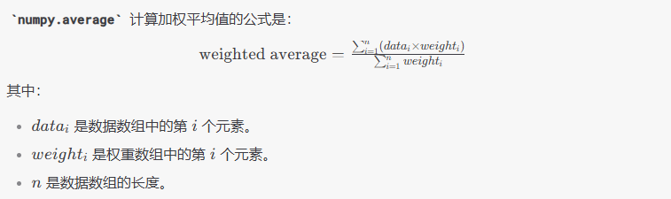

- 取随机值 #numpy
  collapsed:: true
	- 我的理解：不同的随机数种子对应了一组固定的伪随机数，这样是为了可重复实验。使得数据是随机的，但是是可复现的。
	- 可以设置随机数种子，以取不同的随机数序列。
	- ```python
	  N = 1000000
	  for r in np.random.rand(N):
	  ```
- 计算中位数 #numpy
  collapsed:: true
	- ```python
	  x = {1.8, 2.0, 1.7, 1.9, 1.6}
	  np.median(x) # 1.8
	  ```
- 均值 #numpy #Gaussian
  collapsed:: true
	- `mean` 计算算数平均值
		- ```python
		  np.mean(x)
		  ```
	- `average` 计算加权平均值
		- ```python
		  如果不传入任何参数，则average计算的是算术平均值
		  如果传入权重，则计算加权平均值
		  data = np.array([1, 2, 3, 4, 5])
		  weights = np.array([1, 2, 3, 4, 5])
		  weighted_average_value = np.average(data, weights=weights)
		  # Weighted Average: 3.66666
		  ```
		- 
- 求和 #numpy
  collapsed:: true
	- ```python
	  np.sum(belief)
	  ```
- 方差 #numpy #Gaussian
  collapsed:: true
	- ```python
	  print(f"{np.var(X):.2f} meters squared")
	  :.2f表示保留两位小数，f表示浮点数
	  ```
- 标准差 #numpy
  collapsed:: true
	- ```python
	  print(f"std {np.std(X):.4f}")
	  ```
- 生成正态分布函数 #numpy #Gaussian
  collapsed:: true
	- `randn`函数用于生成来自标准正态分布（均值为0，标准差为1）的随机数。
		- ```python
		  from numpy.random import randn
		  data = 1.8 + randn(100)*.1414 
		  # 创建了一个包含100个随机数的数组。
		  # 每个随机数是通过从标准正态分布中抽取一个随机数，然后乘以0.1414（以调整标准差），再加上1.8（以调整均值）得到的。
		  ```
- 从正态（高斯）分布中生成随机数 #numpy
  collapsed:: true
	- `normal`函数可以从正态分布中生成任意数量的随机数
	- ```python
	  loc:正态分布的均值
	  scale:标准差
	  size:生成随机数的数量
	  data = numpy.random.normal(loc=mean, scale=std, size=50000)
	  ```
- 生成均匀间隔数值 #numpy
  collapsed:: true
	- `start`：序列的起始值。
	- `stop`：序列的结束值。
	- `num`（可选）：生成的样本数量，默认为 50。
	- `endpoint`（可选）：如果为 `True`，则包含 `stop` 值；如果为 `False`，则不包含 `stop` 值。默认为 `True`。
	- `retstep`（可选）：如果为 `True`，则返回 (`samples`, `step`)，其中 `step` 是样本之间的间距。默认为 `False`。
	- `dtype`（可选）：输出的数据类型。如果没有指定，则从输入参数推断数据类型。
	- `axis`（可选）：用于存储样本的轴。仅在 `start` 和 `stop` 是数组时适用。
	- ```python
	  numpy.linspace(start, stop, num=50, endpoint=True, retstep=False, dtype=None, axis=0)
	  ```
- 等差数列 #numpy
  collapsed:: true
	- ```python
	  numpy.arange([start, ]stop, [step, ]dtype=None) # 用于生成一个等差数列
	  ```
	- `start`（可选）：序列的起始值。默认为 0。
	- `stop`：序列的结束值（不包含在序列中）。
	- `step`（可选）：序列的步长（即相邻两个值之间的差）。默认为 1。
	- `dtype`（可选）：输出的数据类型。如果没有指定，则从输入参数推断数据类型。
-
-