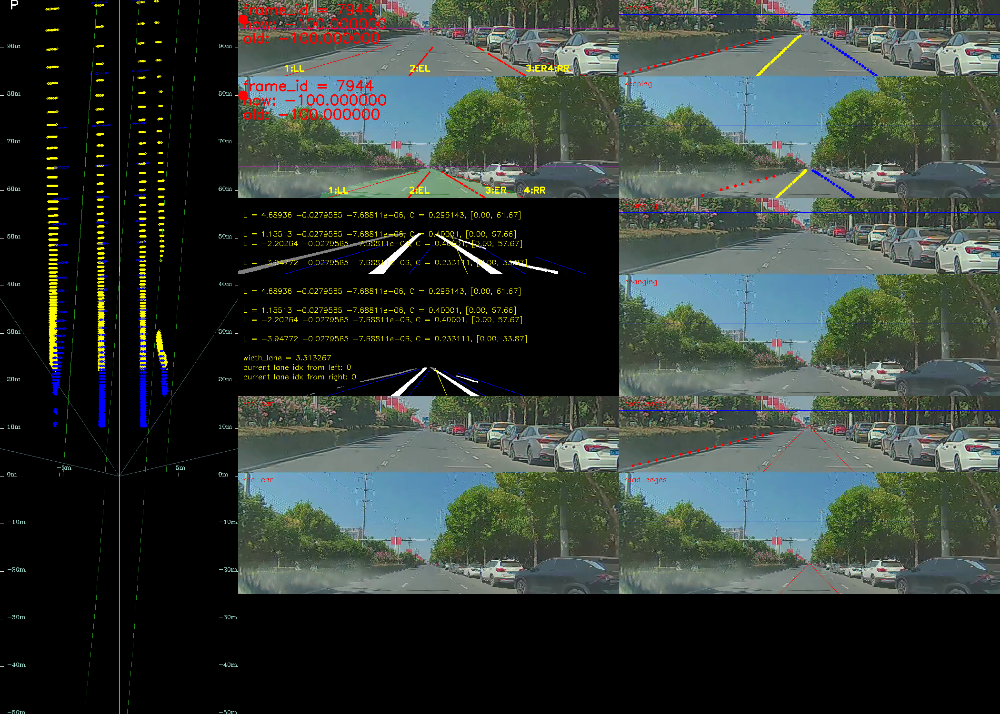

- 思路是：使用运行中的一帧车道线，然后使用该帧车道线通过每一帧估计的外参，以及后续的odom反复投影回后续的uv图上。
	- 我另外想：将每一帧的uv结果投向地面，通过odom转换至世界坐标系的车道线，来对比是否每一帧都重合
- 在lane fusion中`Drap Bad`函数后。在出现一帧车道线后，清掉新进入的车道线，这样之后的帧数会是历史帧的odom投影，以此来验证：
	- ```cpp
	    DropBad(input_splines_map, filtered_splines_map);
	    if (frame_id > 4346) {
	      filtered_splines_map.clear();
	    }
	  ```
- 如下：
	- 
	- 可以看出，真实车道线和投影的车道线有很大差距，且投影次数越多差距越大。==>odom有问题
	-